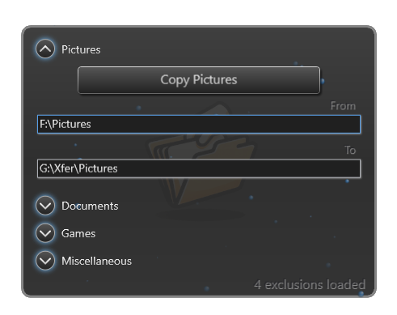
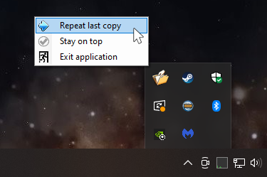

## CopyCuz - WPF

## v1.0.0.0 - December, 2025
**Dependencies**

| Assembly | Version |
| ---- | ---- |
| .NET Framework | 4.8 |

- A [WPF](https://learn.microsoft.com/en-us/dotnet/desktop/wpf) application that hides in the Windows tray and can copy common files/folders from a source to a destination of your choosing.
- At work I commonly keep multiple **Explorer** windows open for copying files/folders back and forth, and it can become annoying to hunt for the correct **Explorer** to copy files from/to when working with multiple applications and building/deploying applications from my workstation to the network.
	+ I realize you can configure post-build events in **VisualStudio**, but I wanted to create this as a more open-ended utility for copying anything you want.
- Clicking on any of the titles, e.g. "Pictures", allows you to change it.
- Running as admin may be required for certain areas of your harddrive.
- The `Exclusions.txt` list can be modified from the app location folder.
	+ The exclusion list supports `*` and `?` wildcards.
- This project includes my home-brew [spinner](https://github.com/GuildOfCalamity/SpinnerDemo) control for the background animations, including the indeterminate progress bar.

